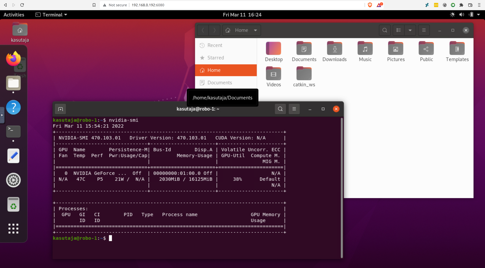

Clone recursively, project uses [existing robotont software](https://github.com/robotont)

`git clone --recursive https://github.com/Tsapu/rem-rob`

# Requirements

- Docker & docker-compose(1.28.0+)
- [nvidia-docker-runtime](https://docs.docker.com/config/containers/resource_constraints/#gpu) (comes with nvidia-docker2)
- nginx
- Nodejs & npm

# Network specification

To allow full communication between the containers and the robotonts *macvlan* docker network type can be used. It requires an ethernet interface with promiscuous mode enabled (does not work with a wireless interface).

### Create the macvlan docker network
1. Toggle promiscuous mode

`sudo ifconfig {eth_iface} promisc`

2. Create the docker network

`docker network create -d macvlan -o parent={eth_iface} --gateway={router gateway} --subnet={router subnet} --ip-range={available range of ip's on the router} {network_name}`

**Example:**
`docker network create -d macvlan -o parent=enp46s0 --gateway=192.168.0.1 --subnet=192.168.0.0/24 --ip-range=192.168.0.192/27 pub_net`

### Make the containers available to host
1. Make a custom macvlan interface

`ip link add {if_name} link {your_eth_if} type macvlan mode bridge`

**Example:**
`ip link add my_nic link enp46s0 type macvlan mode bridge`

2. Give it an IP address

`ip addr add {ip_addr} dev {if_name}`

**Example:**
`ip addr add 192.168.0.224/32 dev my_nic`

3. Enable it

`ip link set {if_name} up`

4. Route all the containers through it

`ip route add {docker_macvlan_ip_range} dev {if_name}`

**Example:**
`ip route add 192.168.0.192/27 dev my_nic`

Based on [this article](https://blog.oddbit.com/post/2018-03-12-using-docker-macvlan-networks/)

# Setup steps

### Building the image

1. Building the image (based on this [image](https://github.com/darkdragon-001/Dockerfile-Ubuntu-Gnome))

`cd images && docker build -t robotont:base .`

2. Specify which robotont mirror to run with docker-compose

`cd images/robotont-{x} && docker-compose up`

3. To make the robotont capable resolving the container hostname, add an entry to its */etc/hosts*

`{container_ip}		robo-{x}`

**Example:**
`192.168.0.192		robo-1`

### Running the proxy server

1. Copy the nginx configuration to default

2. Install main server modules and run (assumes port 3000 as default)

`cd server && npm install`

`npm run start`

## Customizing the gnome GUI

Copy your custom binary (found at `~/.config/dconf/user`) into `images` and rebuild

---

### To do:

- Make the image more user-friendly ✅
- Make a server that can handle multiple websocket proxies at once ✅
- Run the containers as a non-root user ✅

### Limitations & issues:

- After starting the container it takes about half a minute before it loads the graphical gnome config for the user

---

A very configurable docker-vnc setup providing options between lxde, lxqt and xfce4 environments (no gnome) can be found [here](https://github.com/fcwu/docker-ubuntu-vnc-desktop), but I've run into some issues trying to proxy the nginx server that is running inside it.

